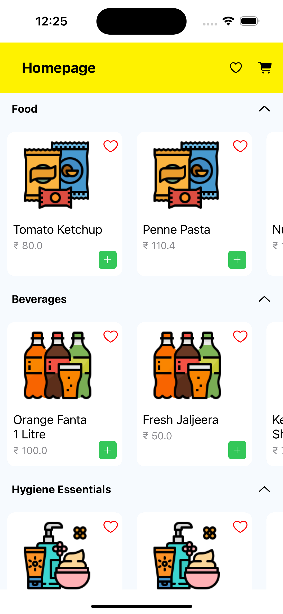
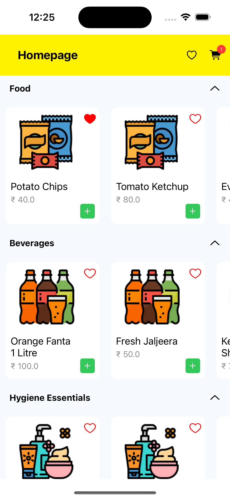
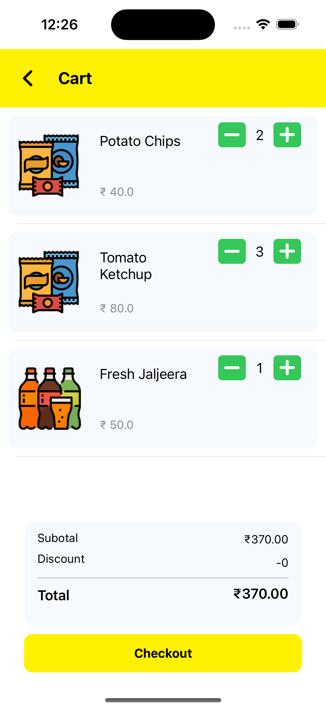
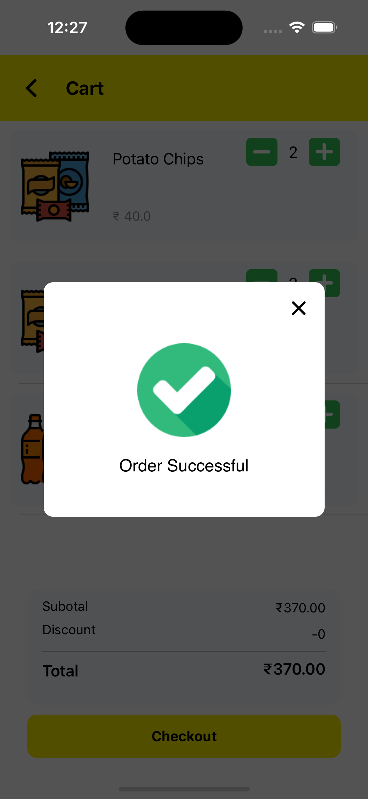
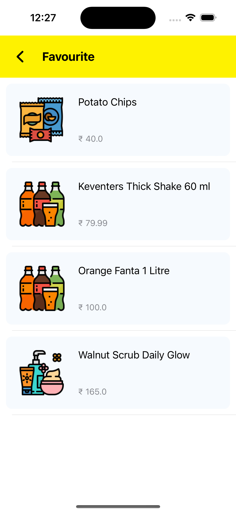

# Ecommerce App

Ecommerce App is a simple shopping application built using Swift and CoreData.

## Features

- Browse products
- Add products to cart
- Favorite products
- Checkout process

## Video

Watch a demo video of the app in action:

[Watch the video](https://drive.google.com/file/d/1Z9skrWwJEU9ueiJuFZ0YKVIWEwVIgDJt/view?usp=sharing)

## Screenshots

### Home Screen


### Product Details



### Cart Screen


### Checkout Process


### Favourites


## Installation

1. Clone the repository:
   ```bash
   git clone https://github.com/AnugrahChaturvedi74/Ecommerce.git
